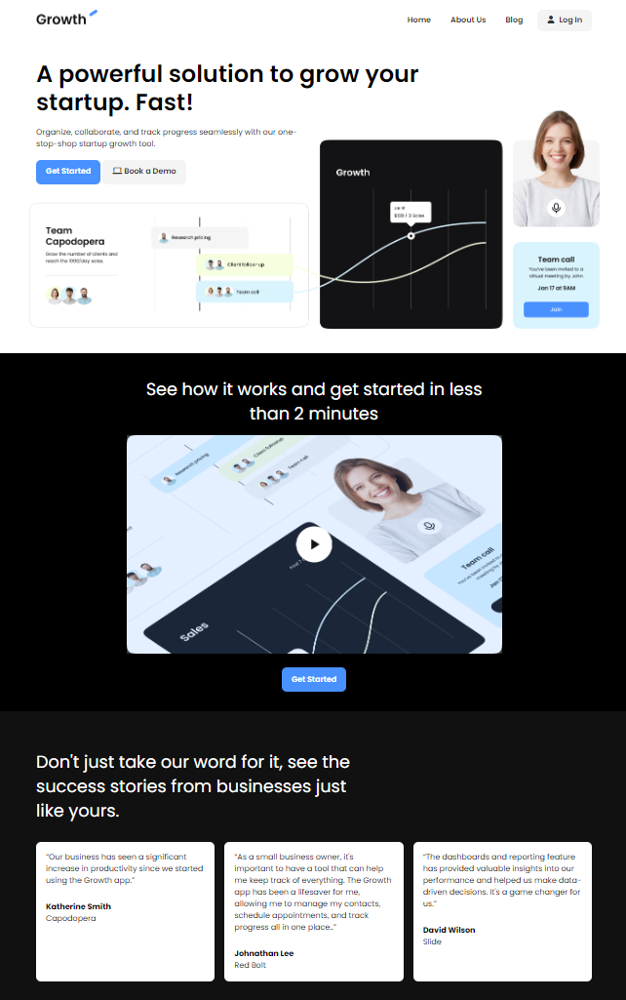

# Saas Company Landing Page

This is a project on building a professional website for beginners.

This project is from the [iCodeThis](https://icodethis.com/?ref=traversy) challenge website and does not use any frameworks or libraries. It is build with pure HTML and CSS and a bit of JavaScript for the hamburger menu and the FAQ accordion.

